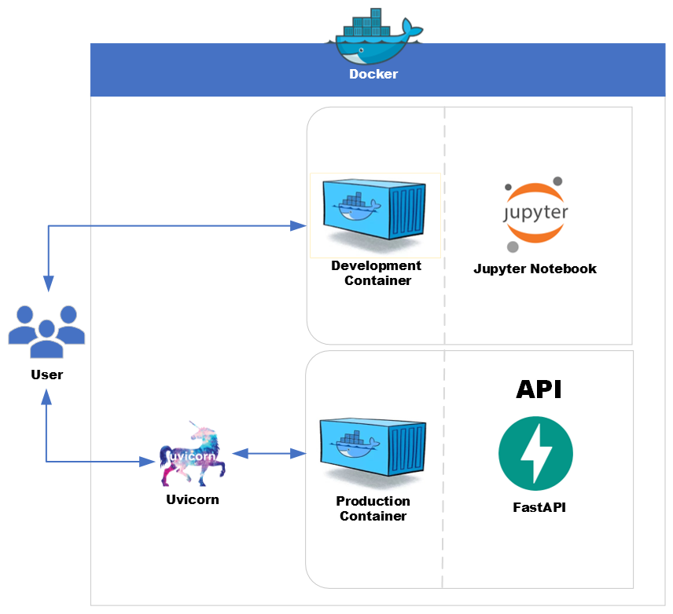

<div align="center">
    
</div>

# Housing Price Regression API with PostgreSQL Integration

- ML Engineering best practices with database persistence
- Regression model deployment as a FastAPI service with PostgreSQL integration, containerized with Docker for scalability and reproducibility

---

- $\textcolor{#FF4500}{\text{You can easily adapt the repository to work with any dataset of your choice.}}$
- The structure is flexible and can be applied to various machine learning models, including $\textcolor{#1E90FF}{\text{regression, classification, and clustering}}$.

---

***Table of Contents***

<details>
  <summary><a href="#1-about-this-repository"><i><b>1. About this Repository</b></i></a></summary>
  <div>
    &nbsp;&nbsp;&nbsp;&nbsp;&nbsp;&nbsp;&nbsp;&nbsp;&nbsp;&nbsp;<a href="#11-who-is-this-project-for">1.1. Who Is This Project For?</a><br>
    &nbsp;&nbsp;&nbsp;&nbsp;&nbsp;&nbsp;&nbsp;&nbsp;&nbsp;&nbsp;<a href="#12-what-will-you-learn">1.2. What Will You Learn?</a><br>
    &nbsp;&nbsp;&nbsp;&nbsp;&nbsp;&nbsp;&nbsp;&nbsp;&nbsp;&nbsp;<a href="#13-prerequisites">1.3. Prerequisites</a><br>
    &nbsp;&nbsp;&nbsp;&nbsp;&nbsp;&nbsp;&nbsp;&nbsp;&nbsp;&nbsp;<a href="#14-contents-of-this-repository">1.4. Contents of this Repository</a><br>
  </div>
</details>
&nbsp;

<details>
  <summary><a href="#2-project-structure"><i><b>2. Project Structure</b></i></a></summary>
  <div>
    &nbsp;&nbsp;&nbsp;&nbsp;&nbsp;&nbsp;&nbsp;&nbsp;&nbsp;&nbsp;<a href="#21-production-environment-dockerization">2.1. Production Environment (Dockerization)</a><br>
    &nbsp;&nbsp;&nbsp;&nbsp;&nbsp;&nbsp;&nbsp;&nbsp;&nbsp;&nbsp;<a href="#22-machine-learning-components">2.2. Machine Learning Components</a><br>
    &nbsp;&nbsp;&nbsp;&nbsp;&nbsp;&nbsp;&nbsp;&nbsp;&nbsp;&nbsp;<a href="#23-database-integration-components">2.3. Database Integration Components</a><br>
    &nbsp;&nbsp;&nbsp;&nbsp;&nbsp;&nbsp;&nbsp;&nbsp;&nbsp;&nbsp;<a href="#24-testing-components">2.4. Testing Components</a><br>
  </div>
</details>
&nbsp;

<div>
  &nbsp;&nbsp;&nbsp;&nbsp;<a href="#3-project-files-and-folders-overview"><i><b>3. Project Files and Folders Overview</b></i></a>
</div>
&nbsp;

<details>
  <summary><a href="#4-how-to-use-and-test-the-project"><i><b>4. How to Use and Test the Project</i></b></a></summary>
  <div>
    &nbsp;&nbsp;&nbsp;&nbsp;&nbsp;&nbsp;&nbsp;&nbsp;&nbsp;&nbsp;<a href="#41-build-and-start-the-containers">4.1. Build and Start the Containers</a><br>
    &nbsp;&nbsp;&nbsp;&nbsp;&nbsp;&nbsp;&nbsp;&nbsp;&nbsp;&nbsp;<a href="#42-test-the-api-endpoints">4.2. Test the API Endpoints</a><br>
    &nbsp;&nbsp;&nbsp;&nbsp;&nbsp;&nbsp;&nbsp;&nbsp;&nbsp;&nbsp;<a href="#43-run-the-tests">4.3. Run the Tests</a><br>
    &nbsp;&nbsp;&nbsp;&nbsp;&nbsp;&nbsp;&nbsp;&nbsp;&nbsp;&nbsp;<a href="#44-use-jupyter-for-development">4.4. Use Jupyter for Development</a><br>
  </div>
</details>
&nbsp;

<details>
  <summary><a href="#5-database-setup"><i><b>5. Database Setup</b></i></a></summary>
  <div>
    &nbsp;&nbsp;&nbsp;&nbsp;&nbsp;&nbsp;&nbsp;&nbsp;&nbsp;&nbsp;<a href="#51-direct-table-creation">5.1. Direct Table Creation</a><br>
    &nbsp;&nbsp;&nbsp;&nbsp;&nbsp;&nbsp;&nbsp;&nbsp;&nbsp;&nbsp;<a href="#52-using-migrations">5.2. Using Migrations</a><br>
  </div>
</details>
&nbsp;

<details>
  <summary><a href="#6-database-development-best-practices"><i><b>6. Database Development Best Practices</b></i></a></summary>
  <div>
    &nbsp;&nbsp;&nbsp;&nbsp;&nbsp;&nbsp;&nbsp;&nbsp;&nbsp;&nbsp;<a href="#61-database-interaction-approaches">6.1. Database Interaction Approaches</a><br>
    &nbsp;&nbsp;&nbsp;&nbsp;&nbsp;&nbsp;&nbsp;&nbsp;&nbsp;&nbsp;<a href="#62-recommended-hybrid-approach">6.2. Recommended Hybrid Approach</a><br>
    &nbsp;&nbsp;&nbsp;&nbsp;&nbsp;&nbsp;&nbsp;&nbsp;&nbsp;&nbsp;<a href="#63-setting-up-database-tools">6.3. Setting Up Database Tools</a><br>
  </div>
</details>
&nbsp;

<div>
  &nbsp;&nbsp;&nbsp;&nbsp;<a href="#7-working-with-postgresql-database"><i><b>7. Working with PostgreSQL Database</b></i></a>
</div>
&nbsp;

<div>
  &nbsp;&nbsp;&nbsp;&nbsp;<a href="#8-summary"><i><b>8. Summary</b></i></a>
</div>
&nbsp;

<div>
  &nbsp;&nbsp;&nbsp;&nbsp;<a href="#9-for-additional-questions"><i><b>9. For Additional Questions</b></i></a>
</div>
&nbsp;

# 1. About this Repository

This project demonstrates an end-to-end ML engineering workflow with database integration focused on a regression task. You can train a housing price prediction model, serve it using a FastAPI application, store predictions in a PostgreSQL database, and experiment interactively with Jupyter Notebook – all within Docker containers. The project is designed to be reproducible and maintainable.

The project provides a comprehensive learning resource with:

- **Core Application Components**:
  - A well-structured FastAPI application with proper routing and middleware
  - Complete PostgreSQL integration using SQLAlchemy ORM
  - Properly organized database package with models, schemas, and CRUD operations
  - Dependency injection for clean, testable code

- **Docker Infrastructure**:
  - Containerized services for API, database, and Jupyter notebook
  - Volume mounting for data persistence and code accessibility
  - Environment variable configuration for flexible deployment
  - Health checks and container orchestration

- **Development Environment**:
  - Jupyter notebooks for data exploration and model development
  - Scripts for database setup and model training
  - Complete test suite for API endpoints and database operations

- **Documentation**:
  - Extensive README files in each directory
  - Detailed explanations of architectural decisions
  - Complete setup and usage instructions
  - Best practices for database integration

This project follows clean architecture principles with a clear separation of concerns, making it an excellent reference for building production-ready machine learning regression APIs with database integration.

## 1.1. Who Is This Project For?

This project is designed for anyone interested in machine learning, API development, database integration, or containerization with Docker. Whether you're a student, developer, or data scientist, this resource will guide you through building and deploying a machine learning API with database persistence using FastAPI, PostgreSQL, and Docker.

## 1.2. What Will You Learn?

By the end of this project, you will:
- Develop a foundational understanding of FastAPI and its setup
- Learn how to integrate PostgreSQL with a FastAPI application
- Understand how to containerize applications using Docker
- Explore how to train and deploy simple machine learning models
- Work with practical examples to build scalable APIs with data persistence
- Gain insights into storing and retrieving ML predictions from a database

## 1.3. Prerequisites

This project is suitable for three types of learners:

1. **For those familiar with Docker, FastAPI, and databases**: You can dive straight into the deployment phase. The examples and configurations provided will help you enhance your skills and explore best practices in building and deploying APIs with database integration.

2. **For those who know Docker and FastAPI but are new to database integration**: This project will introduce you to integrating PostgreSQL with FastAPI, guiding you through building and deploying an API with database persistence.

3. **For beginners**: This project is designed with you in mind. You'll start with the basics, learning how to set up Docker, FastAPI, and PostgreSQL, and then move on to building and deploying a machine learning model with database integration.

## 1.4. Contents of this Repository 

```
Folder PATH listing
.
+---app                           <-- Contains the main application code
|   |   config.py                 <-- Application configuration
|   |   database.py               <-- Database connection configuration
|   |   main.py                   <-- Main FastAPI application
|   |   README.md                 <-- API Application documentation
|   |
|   \---database                  <-- Database components
|       |   crud.py               <-- Database CRUD operations
|       |   deps.py               <-- Dependency injection
|       |   models.py             <-- SQLAlchemy models
|       |   README.md             <-- Database module documentation
|       |   schema.py             <-- Pydantic schemas
|       |   session.py            <-- Database session management
|       |   __init__.py           <-- Package initialization and exports
|       |
|       \---migrations            <-- Alembic migrations
|           |   env.py            <-- Alembic environment configuration
|           |   README.md         <-- Migrations documentation
|           |   script.py.mako    <-- Migration script template
|           |
|           \---versions          <-- Migration version scripts
|                   README.md     <-- Versions directory documentation
|
+---assets                        <-- Contains static assets (images, styles, etc.)
|       logo.png                  <-- Project logo image
|       README.md                 <-- Assets directory documentation
|
+---data                          <-- Directory for storing datasets
|       original_dataset.csv      <-- Example dataset for model training
|       README.md                 <-- Data directory documentation
|
+---docker                        <-- Contains Docker configuration files
|       Dockerfile                <-- Dockerfile for building the API service
|       Dockerfile.jupyter        <-- Dockerfile for setting up Jupyter Notebook
|       entrypoint.sh             <-- Container startup script
|       README.md                 <-- Docker setup documentation
|
+---models                        <-- Stores trained machine learning models
|       ml_model.pkl              <-- Serialized ML model
|       README.md                 <-- Models directory documentation
|
+---notebooks                     <-- Jupyter notebooks for experiments and analysis
|       01_data_exploration.ipynb <-- Notebook for California Housing data exploration and analysis
|       02_model_training.ipynb   <-- Notebook for training and evaluating the regression model
|       README.md                 <-- Notebooks directory documentation
|
+---scripts                       <-- Contains utility scripts
|       db_setup.py               <-- Script for setting up the database
|       train.py                  <-- Script for training models
|       README.md                 <-- Scripts directory documentation
|
+---tests                         <-- Contains automated tests
|       __init__.py               <-- Initializes the tests package
|       test_api.py               <-- API endpoint tests
|       README.md                 <-- Tests directory documentation
|
|   .dockerignore                 <-- Specifies files to exclude from Docker builds
|   .gitignore                    <-- Specifies files to ignore in Git version control
|   alembic.ini                   <-- Alembic configuration
|   docker-compose.yml            <-- Docker Compose configuration
|   LICENSE                       <-- License information for the project
|   README.md                     <-- Project overview and instructions
|   requirements.txt              <-- Lists Python dependencies
```

# 2. Project Structure

## 2.1. Production Environment (Dockerization)

- **docker/Dockerfile**  
  Dockerfile for building the FastAPI application container. It installs the dependencies required for serving the model and connecting to PostgreSQL in a production environment.

- **docker/Dockerfile.jupyter**  
  Dockerfile for building the Jupyter Notebook container. It installs additional dependencies for interactive development and experimentation, including PostgreSQL client libraries.

- **docker-compose.yml**  
  Defines three services:
  - `web`: Runs the FastAPI application, exposing it on port 8000.
  - `jupyter`: Runs a Jupyter Notebook server accessible on port 8888.
  - `db`: Runs PostgreSQL database for storing predictions.
  
  The project uses volume mounts to ensure data persistence and code accessibility across containers.

## 2.2. Machine Learning Components

- **models/ml_model.pkl**  
  A pre-trained machine learning model for California Housing price prediction.

- **scripts/train.py**  
  A training script that loads the California Housing dataset, trains a linear regression model, evaluates its performance using MSE, RMSE, and R² metrics, and saves the trained model.
  
- **app/main.py**  
  The FastAPI application that loads the model and exposes several endpoints for making predictions and accessing the database.

## 2.3. Database Integration Components

- **app/database/**  
  Contains all the database-related components:
  - **models.py**: Defines SQLAlchemy ORM model for storing predictions.
  - **schema.py**: Defines Pydantic models for request/response validation.
  - **crud.py**: Implements database operations for creating and retrieving predictions.
  - **session.py**: Manages database session creation and configuration.
  - **deps.py**: Provides dependency injection for FastAPI.

- **scripts/db_setup.py**  
  A script for setting up the PostgreSQL database and creating necessary tables.

## 2.4. Testing Components

- **tests/**  
  Contains automated tests for the API endpoints and database operations:
  - Tests for health check and root endpoints
  - Tests for prediction endpoint and database storage
  - Tests for retrieving predictions
  - Error handling tests

# 3. Project Files and Folders Overview

- **app/**  
  Contains the main application code:
  - **main.py:** Main FastAPI application with endpoints and model loading.
  - **config.py:** Application configuration settings using Pydantic.
  - **database.py:** Database connection configuration.
  - **database/:** Database components for PostgreSQL integration.

- **assets/**  
  Contains static assets like images and styles, including the project logo.

- **data/**  
  Directory for storing datasets used in the project, including the California Housing dataset.

- **docker/**  
  Contains Docker configuration files:
  - **Dockerfile:** Builds the FastAPI API container.
  - **Dockerfile.jupyter:** Builds the Jupyter Notebook container.

- **models/**  
  Stores trained machine learning models, specifically the housing price regression model.

- **notebooks/**  
  Jupyter notebooks for experiments and analysis:
  - **01_data_exploration.ipynb:** Explores the California Housing dataset with visualizations and statistical analysis
  - **02_model_training.ipynb:** Develops and trains a regression model for housing price prediction, with model evaluation and serialization

- **scripts/**  
  Contains utility scripts:
  - **train.py:** Script for training the ML model.
  - **db_setup.py:** Script for setting up the PostgreSQL database.

- **tests/**  
  Contains automated tests for the application.

# 4. How to Use and Test the Project

## 4.1. Build and Start the Containers

1. Clone the repository:
   ```bash
   git clone <repository-url>
   cd ML_API_with_PostgreSQL_Integration
   ```

2. Build and start the containers:
   ```bash
   docker-compose up --build
   ```

This will start three containers:
- FastAPI application: available at http://localhost:8000
- PostgreSQL database: available at localhost:5432
- Jupyter Notebook: available at http://localhost:8888

## 4.2. Test the API Endpoints

Once the application is running, you can test the endpoints:

1. Swagger UI documentation:
   ```
   http://localhost:8000/docs
   ```

2. Make a prediction using curl:
   ```bash
   curl -X 'POST' \
     'http://localhost:8000/predict' \
     -H 'Content-Type: application/json' \
     -d '{
       "median_income": 8.3252,
       "housing_median_age": 41.0,
       "total_rooms": 6984.0,
       "total_bedrooms": 1467.0,
       "population": 3901.0,
       "households": 1193.0,
       "latitude": 37.88,
       "longitude": -122.23
     }'
   ```

3. Get all predictions:
```bash
   curl -X 'GET' 'http://localhost:8000/predictions'
```

## 4.3. Run the Tests

To run the automated tests:

```bash
docker-compose exec web pytest tests/
```

## 4.4. Use Jupyter for Development

Jupyter Notebook provides an interactive environment for model development, data exploration, and experimentation. You have two options to work with the Jupyter notebooks:

### 4.4.1. Access Options

1. **Through IDE (Recommended)**:

   ○ For VS Code:
   
      a. Press `Ctrl+Shift+P` (Windows/Linux) or `Cmd+Shift+P` (Mac)
      b. Select "Dev Containers: Attach to Running Container..."
      c. Choose the container named `ml_api_with_postgresql_integration-jupyter-1`
      d. When prompted to open a folder, navigate to `/app`
      e. You can now work with notebooks directly in VS Code with all dependencies available
   
   ○ For Cursor:
   
      a. Click the Remote Explorer icon in the sidebar (or press `Ctrl+Shift+P` and search for "Attach to Running Container")
      b. Select the container named `ml_api_with_postgresql_integration-jupyter-1`
      c. When prompted to open a folder, navigate to `/app`
      d. You can now work with notebooks directly in Cursor with all dependencies available

2. **Through Web Browser**:
   
   ○ Open your browser and navigate to http://localhost:8888
   ○ All required dependencies are already installed
   ○ Changes are automatically saved to your local files through Docker volumes

### 4.4.2. Selecting the Correct Kernel

When opening a notebook, make sure to select the correct kernel:

1. For a new notebook, click on "Select Kernel" in the top right
2. Choose "Python 3.10.16 (/usr/local/bin/python)" from the dropdown
3. This kernel has access to all dependencies installed in the container

### 4.4.3. Verifying the Container Environment

If you want to confirm you're working inside the container, run the following code in a notebook cell:

```python
# Check Python version
!python --version

# View container environment variables
import os
print(os.environ)

# Verify the operating system
!cat /etc/os-release
```

The output should show:
- Python 3.10.x
- Container-specific environment variables (including DATABASE_URL with 'db' hostname)
- Debian Linux as the operating system

### 4.4.4. Working with Notebooks

The provided notebooks are:

* `notebooks/01_data_exploration.ipynb`: Explores the California Housing dataset with visualizations and statistical analysis
* `notebooks/02_model_training.ipynb`: Develops and trains a regression model for housing price prediction, with model evaluation and serialization

### 4.4.5. Accessing the Database from Notebooks

To connect to the PostgreSQL database from your notebook:

```python
from sqlalchemy import create_engine
import os

# Get database URL from environment variable
db_url = os.environ.get("DATABASE_URL")

# Create engine
engine = create_engine(db_url)

# Example query
import pandas as pd
df = pd.read_sql("SELECT * FROM predictions", engine)
df.head()
```

### 4.4.6. Troubleshooting

1. **Kernel not starting**: 
   - Verify the container is running with `docker ps`
   - Check container logs with `docker logs ml_api_with_postgresql_integration-jupyter-1`

2. **Missing dependencies**:
   - Dependencies are installed from requirements.txt. If you need additional packages:
     ```python
     !pip install package_name
     ```

3. **Database connection issues**:
   - Ensure the PostgreSQL container is running
   - Verify the DATABASE_URL environment variable with `os.environ.get("DATABASE_URL")`

Note: When working through the IDE, you're actually working inside the container where all dependencies are already installed. This ensures consistency between development and production environments.

# 5. Database Setup

The project uses PostgreSQL for storing prediction data. There are two approaches to database schema management:

## 5.1. Direct Table Creation

By default, this project uses direct table creation for simplicity:

1. Tables are automatically created at application startup using SQLAlchemy's `Base.metadata.create_all()` method in `app/main.py`.
2. The custom setup script `scripts/db_setup.py` runs during container initialization to ensure tables exist.

This approach was chosen for simplicity in a containerized environment where databases are often recreated from scratch.

## 5.2. Using Migrations

While the project is configured with Alembic for migrations, it currently doesn't use migration scripts. To switch to a migration-based approach:

1. Modify the SQLAlchemy models in `app/database/models.py`
2. Generate a migration script:
   ```bash
   alembic revision --autogenerate -m "Description"
   ```
3. Apply the migration:
   ```bash
   alembic upgrade head
   ```

# 6. Database Development Best Practices

When working with databases in a containerized environment, you have multiple approaches for database interaction. This section covers best practices for database development within Docker.

## 6.1. Database Interaction Approaches

### 6.1.1. Using Jupyter Notebooks

**Advantages:**
- **All-in-one environment**: Code execution, data visualization, and database interaction in one place
- **Documentation as you go**: Notebooks serve as self-documenting SQL exploratory sessions
- **Visualization integration**: Easily plot query results using pandas and matplotlib
- **Reproducibility**: Queries and their results are saved together in the notebook

**Best for:**
- Data exploration and analysis
- Creating data processing pipelines
- Prototyping database operations
- Learning and experimentation

### 6.1.2. Using VS Code/Cursor Database Extensions

**Advantages:**
- **Purpose-built tools**: Specialized features like schema visualization and query optimization
- **SQL-focused interface**: Better syntax highlighting and autocompletion
- **Database administration**: Easier to perform administrative tasks
- **Separate concerns**: Keeps database work distinct from application code

**Best for:**
- Schema design and management
- Complex query development and testing
- Database administration tasks
- Day-to-day database operations

## 6.2. Recommended Hybrid Approach

The most effective workflow combines both approaches:

1. **Use VS Code/Cursor Database Extensions for:**
   - Initial database setup and schema management
   - Complex SQL query development
   - Production database migrations
   - Database administration tasks

2. **Use Jupyter Notebooks for:**
   - Data exploration and analysis
   - Combining SQL queries with data processing
   - Documenting database workflows with explanations
   - Visualizing query results
   - Prototyping database interactions for your ML pipeline

## 6.3. Setting Up Database Tools

### 6.3.1. VS Code/Cursor Database Extension Setup

1. Install the `Database Client` or `SQLTools` + `SQLTools PostgreSQL/Cockroach Driver` extensions in VS Code/Cursor
  - `Database Client`: By cweijan
  - `SQLTools`: By Matheus Teixeira
  - `SQLTools PostgreSQL/Cockroach Driver`: By mtxr

2. Configure a new connection using these settings:
   - Host: `localhost`
   - Port: `5432` (the forwarded port)
   - Username: `user`
   - Password: `password`
   - Database: `ml_api_db`

3. `Database Client` vs. `SQLTools` + `SQLTools PostgreSQL/Cockroach Driver`
  - `Database Client`: if you prefer a simple GUI, easy browsing, and minimal setup.
  - `SQLTools` + `SQLTools PostgreSQL/Cockroach Driver`: if you want powerful code integration, deep customization, and adapter flexibility.

  **Option 1: Database Client**
  - Single installation - All-in-one solution with built-in PostgreSQL support
  - **Best for:** Visual learners, beginners, and those who prioritize ease of use
  - Modern interface with intuitive data exploration features
  - Simplified connection setup with fewer configuration steps
  - Better table visualization with interactive data grid view
  
  **Option 2: SQLTools + SQLTools PostgreSQL/Cockroach Driver**
  - Two-part installation - Core SQLTools extension plus PostgreSQL/Cockroach Driver
  - **Best for:** Those comfortable with SQL who need advanced features
  - More comprehensive SQL tooling with deeper code integration
  - Robust intellisense & linting capabilities
  - Highly extensible with plugins and fine-grained configuration
  
  Both options will connect to the project's PostgreSQL database using the same connection parameters. Consider your learning style and preferences when choosing - visual, GUI-focused learners may prefer Database Client, while code-centric, customization-focused learners might prefer SQLTools.

  **Feature Comparison:**

  | Aspect              | SQLTools                                                                                                                                                            | Database Client                                                                                                                                            |
  |-------------------------|------------------------------------------------------------------------------------------------------------------------------------------------------------------------|------------------------------------------------------------------------------------------------------------------------------------------------------------------------------------------------------------|
  | Setup & Configuration | ✅ Large community & docs  <br> ✅ Multiple adapters (MySQL, Postgres, etc.) <br> ❌ More config-heavy (JSON files) <br> ❌ Manual adapter installs needed | ✅ Minimal config required <br> ✅ Quick setup out of the box <br> ❌ Limited advanced settings <br> ❌ Not as flexible with niche databases |
  | UI & Navigation     | ✅ Familiar code-based workflow <br> ✅ Lightweight, integrates well into editor <br> ❌ Less visual exploration <br> ❌ Feels "techy" to newcomers | ✅ GUI-based table browsing & editing <br> ✅ Easy schema view in the sidebar <br> ❌ Can feel heavier/cluttered if you prefer code <br> ❌ Fewer inline code features |
  | Auto-Completion     | ✅ Robust intellisense & linting <br> ✅ Good for large/complex schemas <br> ❌ Requires fine-tuning for some DB engines | ✅ Basic suggestions for major SQL dialects <br> ✅ Enough for quick queries <br> ❌ Not as powerful or customizable as SQLTools <br> ❌ Lacks deeper query analysis |
  | Customization       | ✅ Highly extensible (plugins, adapters) <br> ✅ Fine-grained JSON config <br> ❌ Can be daunting for beginners <br> ❌ Takes time to master | ✅ Straightforward "turnkey" experience <br> ✅ Simple configuration menus <br> ❌ Smaller ecosystem <br> ❌ Fewer ways to adapt to unusual or advanced requirements |
  | Community & Support | ✅ Very large user base, lots of tutorials <br> ✅ Frequent updates & GitHub activity <br> ❌ Some help documents can be spread out <br> ❌ Might lag behind if a DB is extremely new | ✅ Growing but smaller community <br> ✅ Clear official docs <br> ❌ Not as many community-driven resources <br> ❌ Might not have direct support for very new or specialized databases |

**Symbols Used**
- ✅ = Primary strength / core functionality
- ❌ = Limitation / drawback

### 6.3.2. Python Code Pattern for Notebooks

```python
from sqlalchemy import create_engine, text
import pandas as pd
import os

# Get database URL from environment variable
db_url = os.environ.get("DATABASE_URL")
engine = create_engine(db_url)

# For exploratory queries
def run_query(query):
    """Run a SQL query and return results as a DataFrame"""
    with engine.connect() as conn:
        result = conn.execute(text(query))
        return pd.DataFrame(result.fetchall(), columns=result.keys())

# Example usage
df = run_query("SELECT * FROM predictions LIMIT 10")
df.describe()  # Quick statistics
```

This hybrid approach gives you the best of both worlds - specialized database tools when needed and seamless integration with your data science workflow in notebooks.

# 7. Working with PostgreSQL Database

Unlike SQLite which uses a single file, PostgreSQL is a client-server database system that manages data internally. This section explains how data is stored and accessed in this project.

## 7.1. Database Storage in PostgreSQL

When you collect and store data using this API:

1. **Data Storage**: PostgreSQL stores all data in its internal directory structure, which is mounted as a Docker volume (`postgres_data:/var/lib/postgresql/data/`).

2. **No Single Database File**: You won't see a database file in your project directory. Instead, PostgreSQL manages its data files internally.

3. **Persistence**: The Docker volume ensures data persists even if containers are stopped or rebuilt.

## 7.2. Accessing PostgreSQL Data

There are multiple ways to access the stored data:

1. **Through API Endpoints**: Use the provided API endpoints (`/predictions`) to retrieve data.

2. **Direct Database Access**: Connect to the PostgreSQL instance:
   ```
   Host: localhost
   Port: 5432
   Username: user
   Password: password
   Database: ml_api_db
   ```

3. **From Jupyter Notebooks**: Use the SQLAlchemy code pattern provided in section 6.3.2.

4. **Using Database GUIs**: Connect with tools like pgAdmin, DBeaver, or database extensions in VS Code/Cursor.

## 7.3. Database Inspection Commands

When the containers are running, you can inspect the database using:

```bash
# Connect to PostgreSQL container's shell
docker exec -it ml_api_with_postgresql_integration-db-1 bash

# Connect to PostgreSQL with psql client
psql -U user -d ml_api_db

# Useful psql commands:
# \dt - list tables
# \d+ predictions - show table structure
# SELECT * FROM predictions LIMIT 5; - view data
# \q - quit psql
```

## 7.4. Backing Up and Restoring Data

To back up and restore your PostgreSQL data:

```bash
# Backup: from host machine
docker exec -t ml_api_with_postgresql_integration-db-1 pg_dump -U user ml_api_db > backup.sql

# Restore: to host machine
cat backup.sql | docker exec -i ml_api_with_postgresql_integration-db-1 psql -U user -d ml_api_db
```

The client-server architecture of PostgreSQL provides benefits including better performance, concurrent access, and more robust data management compared to file-based databases.

# 8. Summary

This project demonstrates how to build a machine learning API with PostgreSQL integration using FastAPI and Docker. It provides a complete framework for:

1. Training and serving machine learning models
2. Storing predictions in a PostgreSQL database
3. Retrieving prediction history
4. Running everything in Docker containers for reproducibility and scalability

The project is designed to be easily adaptable for different machine learning tasks and datasets while maintaining a strong focus on engineering best practices.

# 9. For Additional Questions

If you have any questions or encounter issues while working with this project, here are several resources to help you:

- **GitHub Issues**: Open an issue in the GitHub repository
- **Documentation**: Refer to the documentation in the respective README files within each directory
- **External Resources**:
  - [FastAPI Documentation](https://fastapi.tiangolo.com/)
  - [SQLAlchemy Documentation](https://docs.sqlalchemy.org/)
  - [PostgreSQL Documentation](https://www.postgresql.org/docs/)
  - [Docker Documentation](https://docs.docker.com/)
- **Contact**: Feel free to reach out to the maintainers of this project
